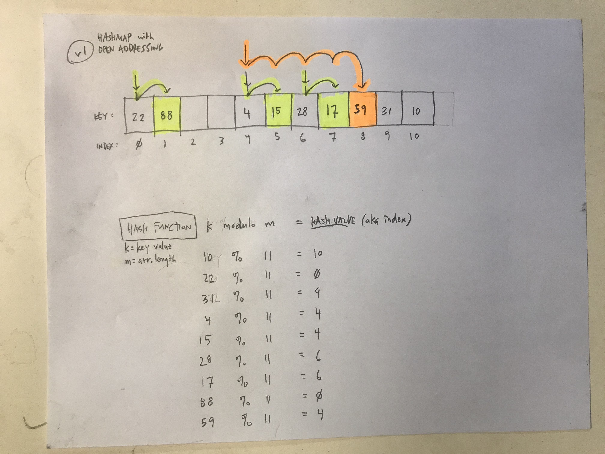
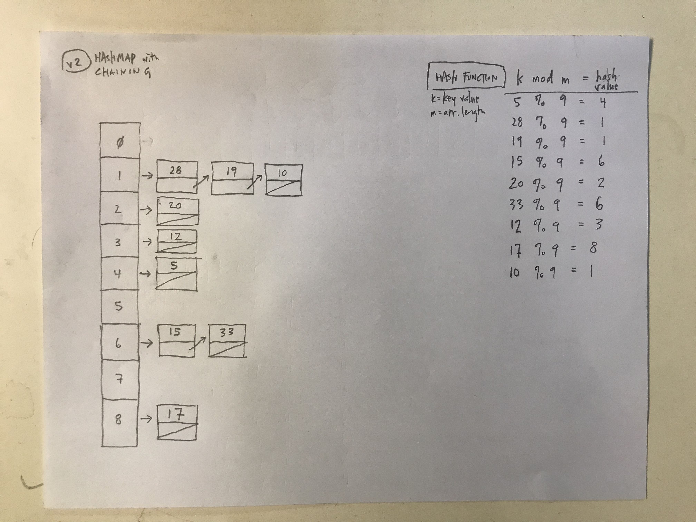

# Working with hash maps

**[Thinkful Data Structures & Algorithms assignment](https://courses.thinkful.com/dsa-v1/checkpoint/7#assignment)**

To run any of these scripts, in terminal command line enter: `node script-name.js`

<br />

## 1. Create a HashMap class

see: **[`hashmap.js`](https://github.com/artificialarea/DSA-Hashmaps/blob/main/hashmap.js)** + **[`lord-of-the-rings.js`](https://github.com/artificialarea/DSA-Hashmaps/blob/main/lord-of-the-rings.js)**

<br />

**Print your hash map and notice the length and items that are hashed in your hash map. Have you hashed all the items you were asked to? What are the values of Maiar and Hobbit that you have? Is there a discrepancy?** Discrepancy? Yes. The length of the Hash Map should be 11, not 9. Instances where there are two items/values with the same `key` -- `Hobbit` and `Maiar` -- only one of their values is displayed, presumably due to collision. Confused why the items weren't hashed/added to an empty slot further along in the array with open addressing... and why their respective second set values actually replaced the first values in the original slots?

Points of confusion:

* Why hasn't the open addressing resolved instancesof collision? It should be hashing / adding the second key values of `Hobbit` and `Maiar` to the next availble empty item? Perhaps there is something missing in my class method or helper?


Output
```js
HashMap {
  length: 9,
  _hashTable: [
    <2 empty items>,
    { key: 'HalfElven', value: 'Arwen', DELETED: false },
    <1 empty item>,
    { key: 'LadyOfLight', value: 'Galadriel', DELETED: false },
    <1 empty item>,
    { key: 'Wizard', value: 'Gandalf', DELETED: false },
    { key: 'RingBearer', value: 'Gollum', DELETED: false },
    <4 empty items>,
    { key: 'Elf', value: 'Legolas', DELETED: false },
    { key: 'Hobbit', value: 'Frodo', DELETED: false },
    <6 empty items>,
    { key: 'Ent', value: 'Treebeard', DELETED: false },
    <1 empty item>,
    { key: 'Human', value: 'Aragorn', DELETED: false },
    { key: 'Maiar', value: 'Sauron', DELETED: false }
  ],
  _capacity: 24,
  _deleted: 0,
  MAX_LOAD_RATIO: 0.5,
  SIZE_RATIO: 3
}

```

Btw, initial output _without_ maximum load ratio
```js
HashMap {
  length: 9,
  _hashTable: [
    { key: 'Maiar', value: 'Sauron', DELETED: false },
    { key: 'RingBearer', value: 'Gollum', DELETED: false },
    { key: 'LadyOfLight', value: 'Galadriel', DELETED: false },
    { key: 'HalfElven', value: 'Arwen', DELETED: false },
    { key: 'Elf', value: 'Legolas', DELETED: false },
    { key: 'Hobbit', value: 'Frodo', DELETED: false },
    { key: 'Wizard', value: 'Gandalf', DELETED: false },
    { key: 'Human', value: 'Aragorn', DELETED: false },
    undefined: { key: 'Ent', value: 'Treebeard', DELETED: false }
  ],
  _capacity: 8,
  _deleted: 0,
}
```


<br />

## 2. WhatDoesThisDo

DO NOT run the following code before solving the problem.

**What is the output of the following code? explain your answer.** 
> Initializes two Hash Maps and sets key/values on them. Uhhhhh... It uses the same string as the key when setting key/values, which results in the hashmap replacing the value stored with that key. In other words, it sets a value at a specific index in the hashmap and then overwrites it. **BUT WHY DOES IT OVERWRITE IT?!?! When you set the second item in each map, it collides with the first and it should shift over to the next available slot, yes?

```js
const WhatDoesThisDo = function(){
    let str1 = 'Hello World.';
    let str2 = 'Hello World.';
    let map1 = new HashMap();
    map1.set(str1,10);
    map1.set(str2,20);
    let map2 = new HashMap();
    let str3 = str1;
    let str4 = str2;
    map2.set(str3,20);
    map2.set(str4,10);

    console.log(map1.get(str1));
    console.log(map2.get(str3));
}
```


<br />

## 3. Demonstrate understanding of Hashmaps

Draw...

1 ] Show your hash map after the insertion of keys 10, 22, 31, 4, 15, 28, 17, 88, 59 into a hash map of length 11 using open addressing and a hash function k mod m, where k is the key and m is the length.



2 ] Show your hash map after the insertion of the keys 5, 28, 19, 15, 20, 33, 12, 17, 10 into the hash map with collisions resolved by separate chaining. Let the hash table have a length m = 9, and let the hash function be k mod m.




<br />

## 4. Remove duplicates